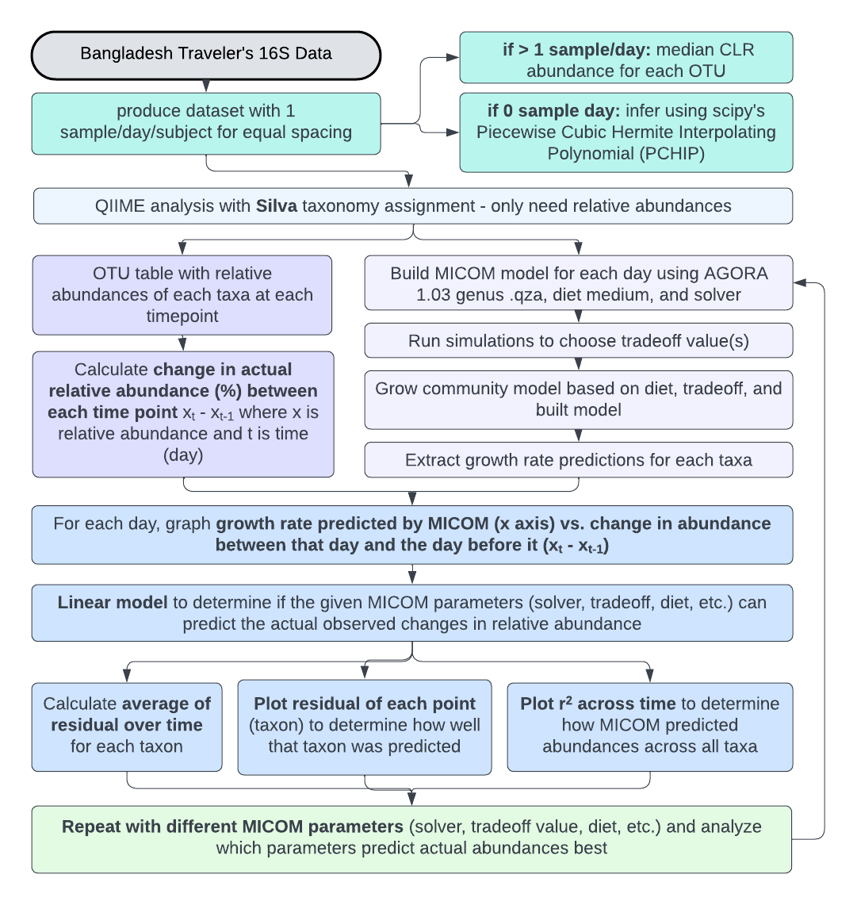
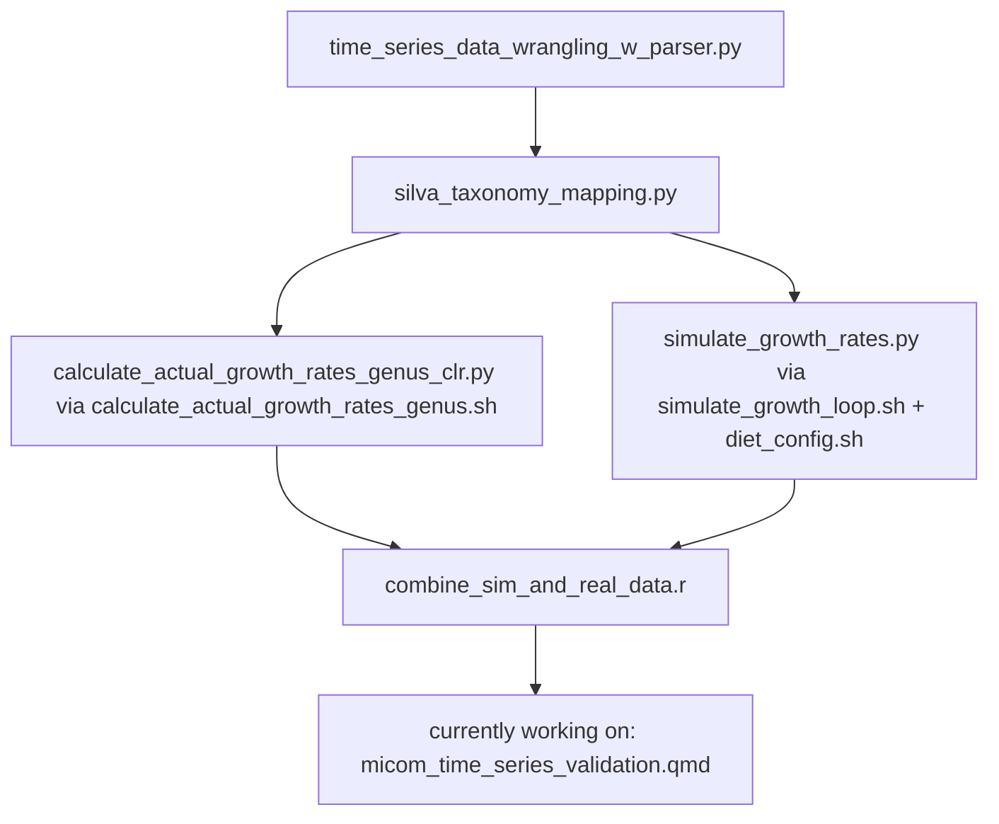

# micom-time-series
using time series data to test micom's ability to predict growth 

## To Do:
  - [x] Recreate directory structure
  - [x] Write thorough documentation about workflow
  - [ ] Tidy up scripts
  - [ ] Update documentation 

# Workflow

## time_series_data_wrangling_w_parser.py
- This script processes OTU tables and metadata for microbiome analysis by:
1. Filtering OTU data and metadata for specific subjects (anonymized names).
2. Averaging microbial abundances for each OTU across samples if mulpiple samples are present for a single day.
3. Identifying missing daily timepoints and interpolating OTU abundance by Piecewise Cubic Hermite Interpolating Polynomial (PCHIP).
4. Combining interpolated time points with real/averaged daily timepoints and preparing them for QIIME2.
5. Updating metadata to include interpolated samples by generating sample IDs and data types ("Real" or "Interpolated").

The script uses command-line arguments for file paths, output directories, and subject IDs, making it flexible for different datasets.

**Outputs**:
- Combined OTU tables for QIIME2 in `.tsv` format.
- Updated metadata files with real and interpolated sample entries labeled accordingly.

## silva_taxonomy_mapping.py
Purpose:
This script processes subject-specific OTU tables and maps OTUs to taxonomy using QIIME2 and the SILVA database.
The workflow includes converting OTU tables to QIIME2-compatible formats, performing taxonomy classification,
and exporting results for downstream analysis.

Workflow:
1. Convert OTU tables (TSV) to BIOM format.
2. Import BIOM files into QIIME2 as FeatureTable artifacts.
3. Classify OTUs using the SILVA Naive Bayes taxonomy classifier.
4. Export taxonomy classifications to TSV format.

Inputs:
- OTU tables in TSV format, with sample IDs as headers and OTU IDs as rows.
- Representative sequences file (QIIME2 `.qza` artifact).
- SILVA taxonomy classifier (`.qza` artifact).

Outputs:
For each OTU table, the script generates:
- `<subject_id>_combined_otu.biom`: BIOM-formatted OTU table.
- `<subject_id>_feature_table.qza`: QIIME2 FeatureTable artifact.
- `<subject_id>_taxonomy.qza`: QIIME2 Taxonomy artifact.
- `<subject_id>_taxonomy.tsv`: Exported taxonomy in TSV format.

## calculate_actual_growth_rates.py
Purpose:
This script calculates the actual change in OTU abundance between consecutive samples
from QIIME2 feature tables (`feature_table.qza`) for multiple subjects. Each subject's 
data is processed independently, and the results are saved separately.

Workflow:
1. Export the feature table for each subject from QIIME2 (`.qza`) to `.biom` format.
2. Convert the `.biom` file to a readable `.tsv` format.
3. Load the `.tsv` into a pandas DataFrame and sort columns (samples) by epoch time.
4. Calculate the change in abundance (ΔAbundance) for each OTU between consecutive days.
5. Collapse by genus
6. Save the resulting growth rates as a `.csv` file for each subject.

Inputs:
- A directory of QIIME2 feature tables (`feature_table.qza`) for multiple subjects.
- A `taxonomy.qza` of the feature_table samples mapped by Silva
- Sample IDs (column headers) as epoch time values in seconds.

Outputs:
- One `<subject_id>_actual_growth_rates.csv` file per subject:
  - Rows = OTU IDs.
  - Columns = Epoch time of the first day in consecutive days.
  - Values = Change in abundance (ΔAbundance).

# Flowchart

