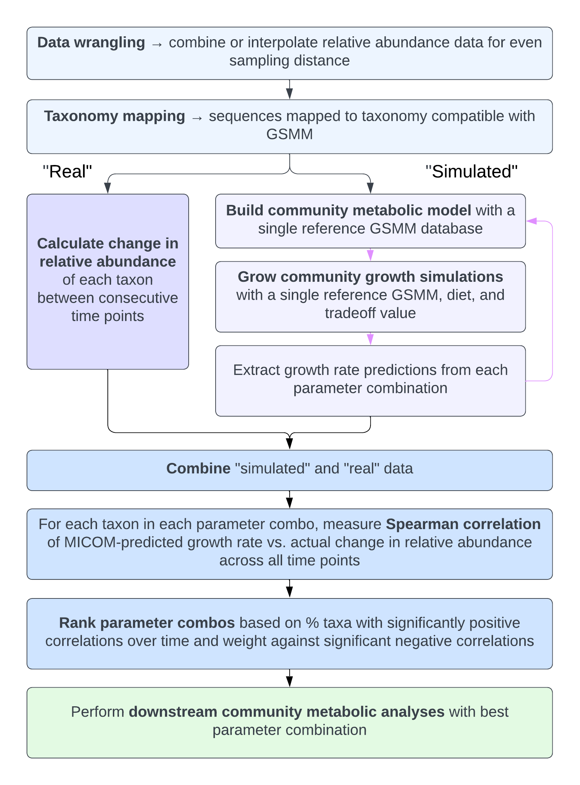
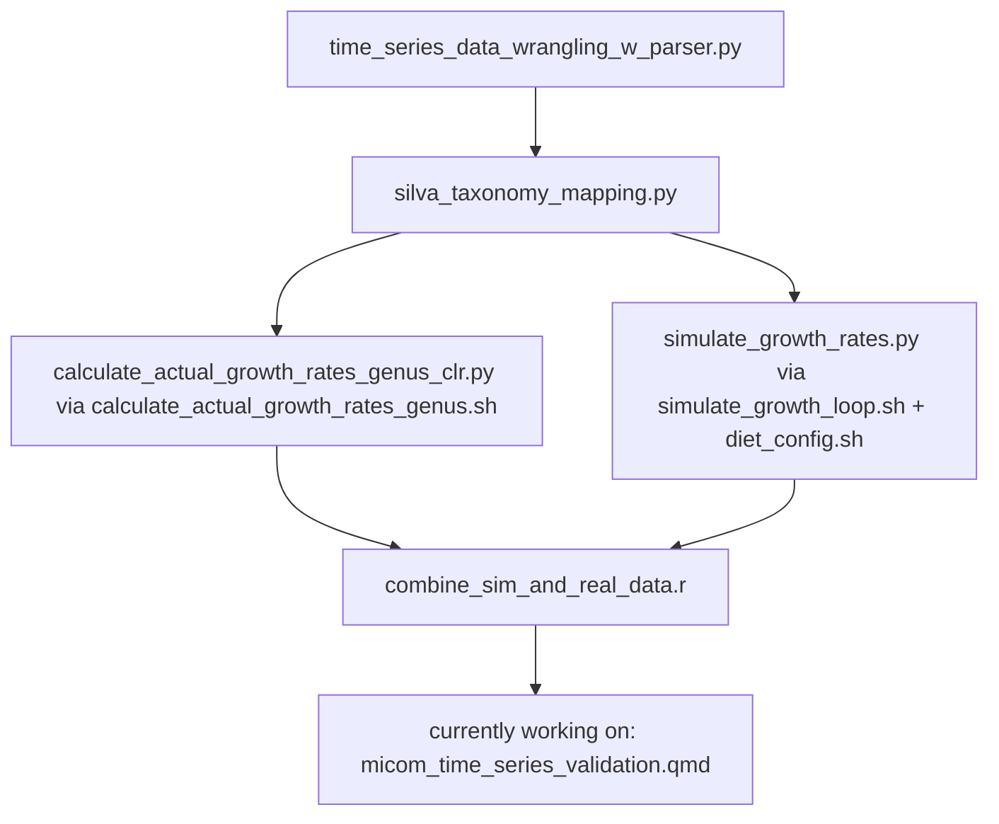

# micom-time-series
using time series data to test micom's ability to predict growth 

## To Do:
  - [ ]Update simulate_growth_rates.py and simuate_growth_loop.py documentation
  - [ ]Add generation of manifest file summary statistics for each folder of pickled models
  - [ ]Generate list metabolites added to diet_sugg for each pickled model
  - [ ]Clean up parameter_combo_testing.Rmd and make into executable R script
  - [ ]Integrate workflow into snakemake 

# Workflow

## time_series_data_wrangling_w_parser.py
- This script processes OTU tables and metadata for microbiome analysis by:
1. Filtering OTU data and metadata for specific subjects (anonymized names).
2. Averaging microbial abundances for each OTU across samples if mulpiple samples are present for a single day.
3. Identifying missing daily timepoints and interpolating OTU abundance by Piecewise Cubic Hermite Interpolating Polynomial (PCHIP).
4. Combining interpolated time points with real/averaged daily timepoints and preparing them for QIIME2.
5. Updating metadata to include interpolated samples by generating sample IDs and data types ("Real" or "Interpolated").

The script uses command-line arguments for file paths, output directories, and subject IDs, making it flexible for different datasets.

**Outputs**:
- Combined OTU tables for QIIME2 in `.tsv` format.
- Updated metadata files with real and interpolated sample entries labeled accordingly.

## silva_taxonomy_mapping.py
**Purpose**:
This script processes subject-specific OTU tables and maps OTUs to taxonomy using QIIME2 and the SILVA database.
The workflow includes converting OTU tables to QIIME2-compatible formats, performing taxonomy classification,
and exporting results for downstream analysis.

**Workflow**:
1. Convert OTU tables (TSV) to BIOM format.
2. Import BIOM files into QIIME2 as FeatureTable artifacts.
3. Classify OTUs using the SILVA Naive Bayes taxonomy classifier.
4. Export taxonomy classifications to TSV format.

**Inputs**:
- OTU tables in TSV format, with sample IDs as headers and OTU IDs as rows.
- Representative sequences file (QIIME2 `.qza` artifact).
- SILVA taxonomy classifier (`.qza` artifact).

**Outputs**:
For each OTU table, the script generates:
- `<subject_id>_combined_otu.biom`: BIOM-formatted OTU table.
- `<subject_id>_feature_table.qza`: QIIME2 FeatureTable artifact.
- `<subject_id>_taxonomy.qza`: QIIME2 Taxonomy artifact.
- `<subject_id>_taxonomy.tsv`: Exported taxonomy in TSV format.

## calculate_actual_growth_rates_genus_clr.py
**Purpose**:
This script calculates the change in CLR-transformed OTU relative abundance values
 between consecutive samples from QIIME2 feature tables (`feature_table.qza`) 
 for multiple subjects. Each subject's data is processed independently, 
 and the results are saved separately.

**Workflow**:
1. Export the feature table for each subject from QIIME2 (`.qza`) to `.biom` format.
2. Convert the `.biom` file to a readable `.tsv` format.
3. Load the `.tsv` into a pandas DataFrame and sort columns (samples) by epoch time.
4. Perform centered log ratio transformations to relative abundance data.
5. Collapse OTUs at the genus level.
4. Calculate the change in abundance (ΔAbundance) for each CLR-transformed 
genus relative abundance between consecutive days.
6. Save the resulting growth rates as a `.csv` file for each subject.

**Inputs**:
- A directory of QIIME2 feature tables (`feature_table.qza`) for multiple subjects.
- A `taxonomy.qza` of the feature_table samples mapped by Silva
- Sample IDs (column headers) as Unix epoch time values in seconds.

**Outputs**:
- One `<subject_id>_actual_growth_rates.csv` file per subject:
  - Rows = genus IDs.
  - Columns = Epoch time of the first day in consecutive days.
  - Values = Change in abundance (ΔCLR-transformedRelativeAbundance).

## simulate_growth_rates.py
Use with bash scripts `simulate_growth_loop.sh` to loop through multiple subjects 
and `diet_config.sh` to define unique abbreviations for different diet parameter inputs
(NEED TO ADD MORE INFO)

## combine_sim_and_real_data.r
**Purpose**: 
This script allows for the outputs of simulate_growth_rates.py (from simulate_growth_loop.sh) 
and calculate_actual_growth_rates_genus_clr.py to be combined into one long format dataframe 
for downstream comparative analyses.

**Workflow**:
1. Read in all actual growth rate files and convert fron wide to long-format
2. Read in all simulated growth rate files and add columns for each micom parameter 
(e.g. micom step, subject, model database, optimization solver, diet, tradeoff value)
3. (OPTIONAL) filter for prevalent taxa 
4. Combine actual and simulated data into one dataframe
5. (OPTIONAL) Add additional metadata columns for later filtering or comparison
6. Save long-format combined df as .csv (`combined_sim_real_data.csv`)

**Inputs**: 
- A list of subject_ids
- corresponding `<subject_id>_actual_growth_rates.csv` file 
(calculate_actual_growth_rates_genus_clr.py output)
- path to "growth_rates" folder output by `simulate_growth_rates.py` 
(must contain .zip and unzipped growth_rates folder for each unique parameter set tested)

**Output**: 
- `combined_sim_real_data.csv`: a long-format dataframe where each row is a single genus within 
a single timepoint of one parameter combination, and columns include MICOM-predicted growth rates, 
metabolites, and reactions; abundance and actual change in abundance between this and the 
next sequential timepoint; and identifiers of each different parameter for filtering and comparison

# Flowchart

